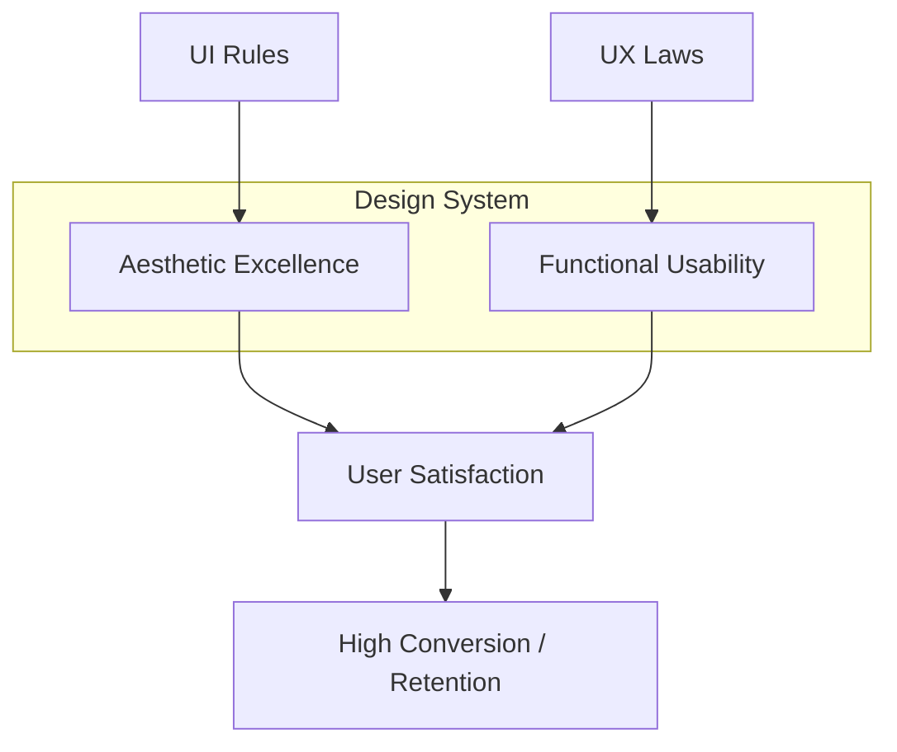

# UI/UX Manifesto

This document serves as the design North Star for the `geologist-fatini` project. It combines psychological principles (Laws of UX) with practical aesthetic guidelines (58 Rules for Stunning UI).

## 🏛️ Architectural Visualization

---

## 🎨 58 Rules for Stunning and Effective UI

### 👥 Audience
1. **Cultural influences**: Factor in diverse backgrounds.
2. **Context of use**: Tailor to industry norms and practical use.
3. **Demographics**: Incorporate insights about age, gender, profession.
4. **Tech-savviness**: Customize to suit technical proficiency.

### 📐 Layout
5. **Negative Space**: Create a clean, uncluttered interface.
6. **Golden Ratio / Rule of Thirds**: Apply mathematical principles for pleasing layouts.
7. **Visual Hierarchy**: Use size, color, and spacing to guide the eye.
8. **Grid Systems**: Ensure consistent structure and alignment.
9. **Focal Point**: Designate a primary area of interest.
10. **Rhythm**: Use repeating patterns to lead users.

### 🧘 Simplicity
11. **Thoughtful Reduction**: Remove unnecessary elements.
12. **Organization**: Group related items to reduce visual complexity.
13. **Intuition**: Don't make users think; ensure it's self-evident.
14. **Minimalism**: Function over ornamentation.
15. **Chunking**: Break huge tasks into smaller steps.
16. **Efficiency**: Savings in time feel like simplicity.

### 🗺️ Journey
17. **Onboarding**: Introduce value immediately.
18. **Intuitive Flow**: Logical and effortless user paths.
19. **Contextual Hints**: Help at the exact moment of need.
20. **Progressive Disclosure**: Show only what is needed at each step.
21. **Action-Oriented**: Clear, standout CTAs.
22. **Feedback**: Visual or haptic acknowledgments for actions.

### ✍️ Typography
23. **Hierarchy**: Different weights and sizes for organization.
24. **Readability**: Easy on eyes across devices.
25. **Brand Mood**: Select fonts reflecting personality.
26. **Pairing**: Harmonic font combinations.
27. **Constraint**: Limit font and style variations.
28. **Refinement**: Adjust line height, spacing, and kerning.

### 🌈 Color
29. **Contrast**: Essential for accessibility.
30. **Palette Consistency**: Unified look and feel.
31. **60-30-10 Rule**: 60% dominant, 30% secondary, 10% accent.
32. **Psychology**: Evoke intended emotional responses.
33. **Semantic Colors**: standard Red (error), Green (success).
34. **Guidance**: Direct attention to interactives through color.

### 🖼️ Visual Content
35. **Content First**: UI supports, doesn't distract.
36. **Purposeful Imagery**: Visuals must add meaning.
37. **Concise Copy**: Straightforward microcopy.
38. **Micro-interactions**: Subtle motion for engagement.
39. **Video**: Dynamic storytelling for complex concepts.
40. **Quality**: High-quality renders build trust.

### 🚀 Novelty
41. **Originality**: Signature look setting you apart.
42. **Tech Leverage**: Use latest tools and capabilities.
43. **MAYA Principle**: Most Advanced Yet Acceptable.
44. **Cross-Industry Inspiration**: Look beyond UI for solutions.
45. **Trends**: Be conscious of them, but don't follow blindly.
46. **UX Enhancing**: Novelty must solve problems, not complicate.

### 🔄 Consistency
47. **Design System**: Reusable components and rules.
48. **Pattern Constraint**: meeting user expectations with standards.
49. **Predictability**: Elements behave as expected.
50. **Standard Templates**: Layout consistency across page types.
51. **Cross-Device**: Seamless mobile, tablet, desktop.
52. **Content Standards**: Consistent voice and tone.

### 🎮 Engagement
53. **Gamification**: Rewards and challenges.
54. **Personalization**: Tailor the experience.
55. **Storytelling**: Emotional connection through narrative.
56. **Progress Display**: Show users how far they've come.
57. **Variable Reward**: Surprise and delight.
58. **Social Integration**: Foster community.

---

## 🧠 21 Laws of UX (Consolidated by Jon Yablonski)

These psychological principles govern how users perceive and interact with our system.

### 01 Aesthetic-Usability Effect
Users often perceive aesthetically pleasing design as a design that's more usable. Cultivate a "Sovereign" aesthetic to increase user tolerance for minor technical frictions.

### 02 Doherty Threshold
Productivity soars when interactions occur at a pace (<400ms) that ensures neither wait on the other. Use skeleton loaders and optimistic UI if backend latency exceeds this.

### 03 Fitt's Law
The time to acquire a target is a function of distance and size. Make "Critical Action Targets" large and centrally located or edge-aligned for easy reach.

### 04 Goal-Gradient Effect
The tendency to approach a goal increases with proximity. Use progress bars that start with "bonus" progress to accelerate onboarding completion.

### 05 Hick's Law
Decision time increases with the number of choices. Minimize navigation nodes to prevent "Choice Paralysis" in the Hub.

### 06 Jakob's Law
Users prefer your site to work like sites they already know. Follow standard Dashboard/SaaS patterns for familiarity.

### 07 Law of Common Region
Elements sharing a defined boundary are perceived as a group. Use cards and containers to isolate related professional data.

### 08 Law of Proximity
Objects near each other tend to be grouped together. Use whitespace deliberately to signal content relationships.

### 09 Law of Pragnanz
People interpret complex images as the simplest form possible. Avoid "Visual Noise" in technical charts.

### 10 Law of Similarity
Similar elements are perceived as a complete picture. Use consistent styling for all "Intelligence Nodes."

### 11 Law of Connectedness
Visually connected elements are perceived as more related. Use lines or shared backgrounds to link multi-step processes.

### 12 Miller's Law
The average person keeps only 7(±2) items in working memory. Chunk complex geological data into manageable clusters.

### 13 Occam's Razor
Among competing hypotheses, select the one with the fewest assumptions. Simplify UI logic to its most efficient state.

### 14 Pareto Principle
80% of results come from 20% of effort. Focus high-fidelity design on the 20% of features used 80% of the time (CV, Hub, Search).

### 15 Parkinson's Law
Tasks expand to fill available time. Use clear deadlines and "Time-to-Complete" estimates in forms.

### 16 Peak-End Rule
Experiences are judged by their peak and their end. Ensure the "CV Export" (End) and "AI Generation" (Peak) are flawlessly premium.

### 17 Postel's Law
Be liberal in what you accept, conservative in what you send. Robustly handle all user input formats (phone numbers, addresses) on the backend.

### 18 Serial Position Effect
Users remember the first and last items best. Place critical links at the Top and Bottom of navigation menus.

### 19 Tesler's Law
Complexity cannot be reduced, only shifted. Shift complexity from the User to the Intelligence Engine (Automation).

### 20 Von Restorff Effect
The object that differs from the rest is most likely remembered. Use "Isolation Effects" for Pro/Premium features.

### 21 Zeigarnik Effect
People remember uncompleted tasks better. Use "Persistence Notifications" for incomplete profile milestones.

---

## 🎖️ Shneiderman's 8 Golden Rules

The foundational pillars for productive and frustration-free user interfaces.

1. **Strive for Consistency**: Layouts, color codes, and button sizes must remain unified across the Sovereign platform.
2. **Enable Shortcuts**: Allow power users to navigate the Hub with minimal clicks (Keyboard navigation, direct links).
3. **Informative Feedback**: Every click must have a response (loading spinners, success toasts, micro-animations).
4. **Design Dialogs to Yield Closure**: Multi-step forms must end with a "Success" state to reduce mental load.
5. **Offer Simple Error Handling**: Don't just say "Error." Provide a "Descriptive Prompt" on how to fix it immediately.
6. **Permit Easy Reversal of Actions**: Every "destructive" action must have an "Undo" or "Cancel" safety net.
7. **Support Internal Locus of Control**: The user must feel like they are the master of the system, not the passenger.
8. **Reduce Short-term Memory Load**: Keep displays simple. Never force a user to remember data from one screen to use on another.

---

## 🐚 The Golden Ratio Law (1:1.618)

Use mathematical proportions to build harmonic compositions.
- **Balanced Content**: Divide layouts using the 1.618 ratio to decide the width of the Main Content vs. Sidebar.
- **Visual Hierarchy**: Use the ratio to scale font sizes (e.g., 16px body -> 26px heading -> 42px hero).

---

## 📱 Mobile & PWA UX Laws

Specific directives for secure, high-density technical mobile experiences.

### [Fitts’s Law](https://lawsofux.com/fittss-law/) (Mobile Optimization)
Ensure "Critical Action Zones" (e.g., Request Consultation, Print CV) use large, high-contrast hit targets (min 44x44px) positioned for thumb-reach.

### [Hick’s Law](https://lawsofux.com/hicks-law/) (Decision Control)
Reduce choice overload in mobile navigation. Use a bottom-tab or simplified hamburger menu to keep the user focused on core "System Nodes."

### [Jakob’s Law](https://lawsofux.com/jakobs-law/) (Standardization)
Users expect mobile apps to behave like standard OS environments. Use familiar gestures and patterns (swipe to close, bottom sheets).

### [Miller’s Law](https://lawsofux.com/millers-law/) (Information Density)
Chunk complex geological/technical data into manageable cards. Use **Progressive Disclosure**—only show high-level "Ground Truth" first, then reveal deep specs on interaction.

### Principles for Technical Professionalism
-   **Trust & Professionalism**: Minimalist, high-security aesthetic (dark modes, glassmorphism, precise borders).
-   **Data Visualization**: Use micro-charts or indicators to represent complex subsurface relationships without text overload.
-   **Intuitive Navigation**: Primary dashboard functions (Case Tracking, CV Access) must be accessible within 2 taps.
-   **Performance First**: Zero-latency transitions. Speed is a primary trust signal in high-stakes engineering.

### "Craft" Design Language Standards (Geological Intelligence)
-   **Typography**: Use **Geist Mono** for all technical metadata, ID strings, and verification codes. It signals "Machine-Readable Precision."
-   **Palette**: Utilize a neutral **Stone/Sand** palette (backgrounds: Stone-50, borders: Stone-100/200, text: Stone-900). Neutrality reflects geological objectivity.
-   **Tracking**: Implement **-0.02em tracking** on all high-fidelity headings and technical blocks. Tight tracking creates a sense of "Information Density" and professional authority.
-   **Administrative Artifacts**: Components like the `ComplianceMatrix` must present as un-editable, "certified" artifacts, using precise borders and mono-fonts to build trust.
